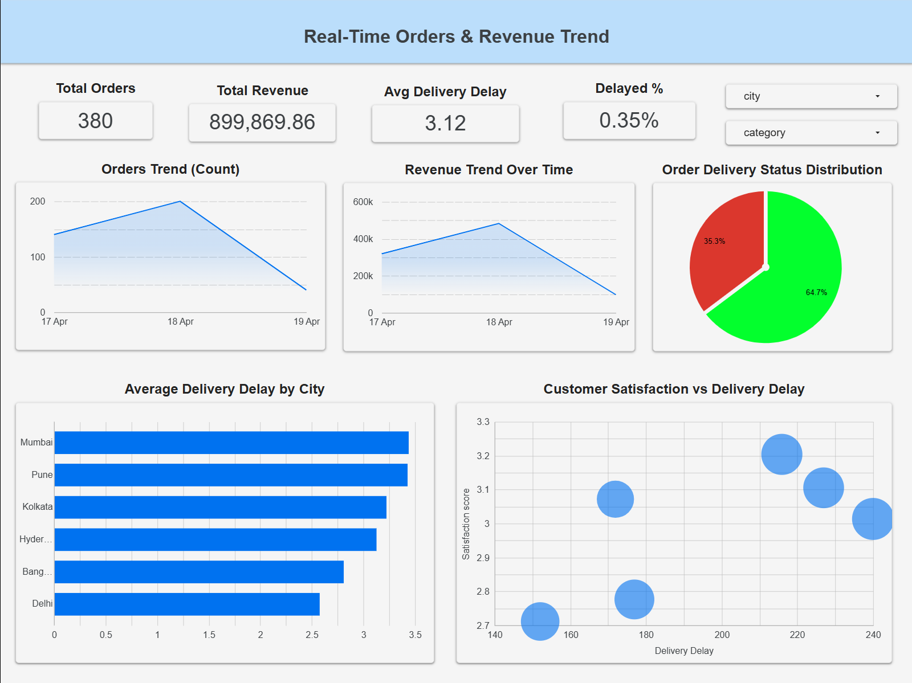

# Real-Time E-commerce Operations Dashboard

## Project Overview
A data-driven real-time dashboard built to monitor e-commerce operations, focusing on delivery performance, revenue trends, and customer satisfaction.  
The solution enables businesses to shift from reactive issue handling to proactive operational decision-making using continuously updated data.

---

## Data Source
The dataset is automatically generated and updated every hour using a Python-based pipeline. It captures key operational signals including:

- Order details (order_id, order_time, delivery_time)
- Financial data (order_value, discount, Net Revenue)
- Delivery performance (Delivery Delay, Is Delayed Flag)
- Customer insights (city, category, satisfaction_score)

Derived metrics such as Delivery Delay, Net Revenue, and Delay Flags are calculated for deeper analysis.

---

## Tools Used
- Python (Data Generation & Automation)
- GitHub Actions (Scheduled Data Pipeline)
- Google Sheets (Real-time Data Storage)
- Looker Studio (Dashboard & Visualization)

---

## End Result
The dashboard provides:

- Real-time tracking of orders and revenue trends  
- Identification of delivery delays across cities  
- Distribution of on-time vs delayed deliveries  
- Correlation between delivery delay and customer satisfaction  
- Interactive filtering by city and product category  

It enables businesses to monitor operations live and take faster, data-driven decisions to improve delivery efficiency and customer experience.

---

## Dashboard Preview

Live Dashboard: https://datastudio.google.com/reporting/77c1aa55-d75e-435d-a1f5-8c09b5f688f2